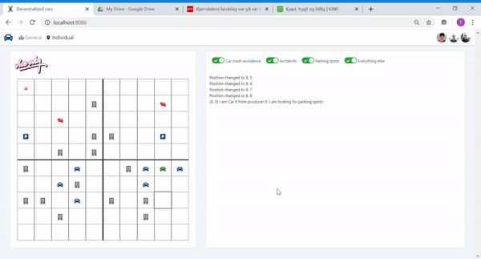

# Simulation of a Decentralized Network of Autonomous Cars



As the development of automated, self-driving car technology advances rapidly, the need
for robust intercommunication between cars grows as well. There are many reasons one would
want to send messages through a network of self-driving cars - whether it be to warn far-away
cars about accidents so that they can reroute, or for close-range communication in order to
synchronize traffic stops. Certainly, one could look at this as a decentralized system of
independent nodes. We wanted to create a simulation of self-driving cars that operate in a
decentralized fashion. To do this we had created a basic movement scheme for a set of cars, and
as the cars move around the map, they have to communicate between each other in order to
achieve certain objectives - e.g. avoid collisions, negotiating between each other, alerting of
accidents on the road and managing parking spots, everything while they try to reach their target location.

[View here the full report of the project.](/Report.pdf)
The architecture and protocol are explained in detail along with a related work study and future work.

[Visit the front-end code](https://github.com/carlosvillasanchez/decentralized-car-network-UI)

## Team members

- Torstein Meyer
- Fernando Monje
- Carlos Villa

## How to run it

```bash
go run . [-wt][-v]
```

wt: To activate the web of trust

v: For verbose traces

**The program will run in *localhost:8086***

## How it works

Once the program is launched, the UI is accessible where the user defines the map placing buildings, parking spots and accidents. The user also defines the moving cars, setting the start and end point. Then, the simulation starts.

When the simulation starts, the nodes of the network (cars) are launched and starts communicating with each other using the 3 layer communication network. They will move from the origin to the destination in the shortest path possible avoiding a crash.

In addition, the detection of accidents and parking spots are informed, activating the police (a special node of the system) or, in the case of the parking spots, changing the destination of a car looking for a place to park.

The explanation of the way cars communicate and the assignation of the free parking spots can be read in the report. [Check it out here!](/Report.pdf)

## Demos

[Watch four demos here!](/demos)